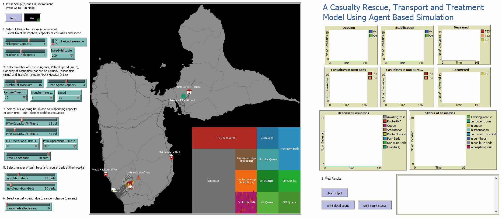

# Casualty Rescue Transport and Treament Model

## Table of Contents
* [What is it?](#what-is-it)
* [How it works?](#how-it-works)
* [Model Specifics](#model-specifics)
* [Model Assumptions and Limitations](#model-assumptions-and-limitations)
* [How to setup?](#how-to-setup)
* [How to use it?](#how-to-use-it)
* [Things to notice or try](#things-to-notice-or-try)
* [Resources](#resources)

## What is it?
The speed at which emergency services respond following a volcanic eruption plays a vital role in determining the survivability of casualties. Residents in impacted zones exposed to a pyroclastic density current will suffer severe burns and will require intensive treatment and care. However most hospitals have very limited capacity to treat burn victims and therefore the management of casualties can have a large impact on their survivability. Mitigation plans need to be enforced to enable swift access to vital equipment such as ventilators.

This model will use an Agent-Based-Modelling approach to quantify the impact of casualty rescue and treatment on casualty survivability. The selected study area is the island of Guadeloupe, where the populated area of Basse Terre and Saint Claude are in close proximity to volcano La Soufrière.

#### What affects casualty survivability ?
* Severity of injuries
* Age and health conditions
* Time to recieve medical treatment
* Overloading at hospitals
* Modes of rescue (helicopter / ambulance)
* Location of treatment facilities
* Damage to transportation systems
* Availability of medical equipment
* Area of Impact : Number of casualties affected

## How it works?
The model simulates evacuation scenarios following a volcanic crisis, and explores the impact on casualty survivability using an agent based modelling approach in a GIS setting. The effects on casualty survivability is explored through different scenario testing where different parameters are varied to examine their impact.

Rescuers, casualties, medical facilities and other infrastructure are modeled as either stationary or active agents (moves across the netlogo space). To allow rescuers to travel, to and from medical facilities to impacted zones, a shapefile consisiting of the transport infrastructure is input into the model. The model converts polylines and polyline intersecting points to links and nodes respectively. This allows agents (rescuers) to travel from node to node till they reach their destination. Helicopters are allowed to move across the space using patches which is square grid with x, y coordinates that is included within the netlogo interface. All agents (casualties, rescures & medical facilities) are situated in the closest node from their input location (GIS lat/lon coordinate).

The overal time passed since eruption is measured using ticks which corresponds to a minute in real life.

The model measures the impact on casualty survivability through examining the number of casualties deceased within a specific time or at the end of simulation. Actions such as casualties been transported to medical facilites faster or offered better medical equipment will redcue the morality rate thereby improving casualty survivability.

#### Type of agents and their attributes

#### Rescue operation procedure

## Model Specifics
* Casualties are classified into 3 categories and distinguished by the trauma scale attribute(TS). The trauma scales is defined as combination of the severity  of injuries (Total Body Surface Area - TBSA) and mortality
  * TS1 (yellow) : Low injuries, Low mortality
  * TS2 (orange) : Burn wounds 20-40% TBSA, High mortality without treatment
  * TS3 (Red) : Burn wounds > 40% TBSA, High mortality with or without treatment

* Rescuers are classified in to 2 categories
  * Ambulances
    * Type-A (white with red cross) 
      * Performs rescue operations in the impacted zone. Responsible for transporting casualties from field to PMA (Triage - Feild hospital).
      * Transports all casualties (Trauma scale 1,2 & 3)
      * Joint first priority rescue for casulaites of category TS2 and TS3. This means that even if there were TS1 casualties withtin the same node as TS2 or TS3 casualty, rescuers will ignore them and search for other TS2 and TS3 casualties provided they have capacity for further rescuing.
      * TS1 casualties will only be rescued once all TS2 and TS3 casualties are rescued from the impacted zone.  
    * Type-B (Red with white cross) 
      * Performs transporting casualties from PMA to hospital.
      * Transports only casualties with trauma scale 2 & 3
  * Helicopters
    * Transports casualties from impacted zones to hospital
    * Only Transports casualties with trauma scale 2 & 3.
    * They travel to and from hospital to the impact zone until all TS 2 and TS 3 casualties are rescued.
    
* PMA (triage / field hospital)
  * Performs stabilisation for casualties of trauma scale categories 1,2,3
  * Two PMA's are setup one in Sainte Marie and the other in Vieux Habitants
  * Capacity of casualties that can be treated at one time is decided by the number of medical staff available.
  * If Stabilisation capacity is reached casualties will be added into queue.
  * The rescue agents will decide on which PMA to travel to depending on the number casusilies in queue (travels to the smaller queue)
  * If there is no queue (if there is availability in stabilisation - enough doctors available to treat casualties at that time) rescue agents will travel to the closest PMA.
    * Rescue agents will make decisions to travel to a certain PMA once its capacity has been reached. Once a decision has been made, the rescue agent will not change course to travel to a different PMA if stabilisation capacity has been reached. 
  * Upon availabilty in stabilisation queue, casualties will be transfered to the stabilisation queue.
  * Casualties with Trauma scale 2 and 3 are transported for further treament at hospital after stabilisation.
  * Casualites of Trauma scale category 1 are considered recovered after stabilisation
  * If stabilisation isnt open casualties will be added into the queue.
 
* Hospital
  * Provides treatment for casualties with Trauma scale 2 and 3.
  * Medical equipment
    * Burn Beds (BB)
      * casualties who are offered burn beds will have reduced  mortality rate
      * Priority given to casulties with TS3.
      * However TS3 casulties brought at a later time will be not offered burn beds if TS2 casualties are occupying burn beds.
    * Non Burn Beds (NBB)
      * casualties who are offered treatment at Non burn beds will have reduced mortality rate (lower than burn beds) 
      
* General
  * Model will run for 7200 ticks which refers to 5 days since impact in real life
    
## Model Assumptions and Limitations

* Rescuers (Ambulance Type - A)
  * Dont stop for activities such as refuling etc.
  * Its assumed that all rescuers travel at the same speed (speed will not change based on road type).
  * Munkres assignment algorithm is used to optimise the assignment of casulty to each rescuer based on distance.
    * The algorithm minimises the total distance to travel by selecting the best rescuer-casualty combinations.
    * Ref : J. Munkres, "Algorithms for the Assignment and Transportation Problems", Journal of the Society for Industrial and Applied Mathematics, 5(1):32–38, 1957 March.
    * Two or more rescuers will not be assigned to the same casualty. However two or more rescuers may travel to same node if there are multiple casualties situated within the same node. This may reduce the efficiency of the munkres algorithm. 
  * At start of each rescue operation (at the PMA), its assumed that the location and the casualty agent to be rescued is known by every rescue agent. However to account for the time taken for searching (general vicinity) and rescuing (i.e loading to the ambulance etc.) a resue-time parameter is available in the model inteface, which can be set by the user.
  * Rescuers travel a unit distance within a tick (a minute in real life). Usually upon reaching close to casualty, PMA, hospital(Rescuers Type B), the distance to travel to the destination (node) will be less than the distance traveled within a tick. This will impose an casualty rescue time error of up to one tick (a minute in real life) and vice versa.
    * To minimises some of this error rescuers (Rescuers Type A) will travel an extra distance once rescue operation is completed (loaded in to ambulance) or once they reach PMA and drop casulties (remaider distance from previous run).
    
* Rescuers (Ambulance Type - B)
  * All points Rescuers, Ambulance Type - A apply to Ambulance Type-B as well.
  * Travel only in one direction, from PMA to Hospital. They do not return to PMA after transferring patients to the hospital.
  * Its considered that there are unlimited number of Ambulances (Type B)
  * Travels to hospital as soon as there are any stabilised casualties at the PMA (Do not wait for other casualties to be stabilised since there are an unlimited number of ambulances) 

* Rescuers (Helicopters)
  * Helicopters travel in straight lines (from hospital to impacted zones). They do not follow any sort of airline routes that are possibly taken in real life.
  * Do not stop for activities such as refuling etc.
  * Point 1,2,3 & 4 from rescuers (Ambulance Type - A) apply to helicopters as well.
    * Note the munkres algorithm is computed seperately for Helicopter and ambulances (Type - A). Thefore it doesnot compute most efficient assignment for all rescue agents (Helicopters + Ambulance Type -A), just for each agent class.  
   
* Casualties
  * Casualties are assigned to the closest node from their input location (GIS .shp file). So it is assumed that casualties are within the vicinity of roads in the impacted zone. 

* PMA (Triage / Field Hospitals)
  * Its assumed that PMA's are setup within 1 hour of eruption (Rescuers Type - A, activates at 60 ticks) 

* Hospital
  * Its is assummed that the hospital contains a helipad

* General
  * All casualties and medical facilities are situated at the closest node from their inputed location (gis .shp file)

## How to setup?

#### Netlogo
* The netlogo application is required for you to run the model.
* Download and install Netlogo version 6.1.0 
  * https://ccl.northwestern.edu/netlogo/download.shtml
* If .nlogo files **is available** to you (not the .nlogo code available on github) double click top open.
* If .nlogo file is **NOT** available follow section 'Setting up Netlogo Interface'.

#### GIS

* The required GIS files are found in the GIS folder in the repository
  * Description of the GIS files
    * "Edited_Gudaloupe_boundary.shp" : Gudaloupe country boundary shape file
    * "LaSoufrière_ImpactZones.shp" : Boundaries of the impact zones
    * "Primaryrds_edited_04_EPSG36320.shp" : Part of the road network (display the main roads/highways and more denser road network at impact zones)
      * Road network outside of the impact zone was removed to reduce setup loading times.
    * "PMA_and_Hospital_Airport_Volcano_Nodes_EPSG36320.shp" : Locations of infrastructure (PMA/Hospital/Volcano etc.)
    * "PDC_Humans_default.shp" : Location of casualties and their trauma scale category
* Copy them to the desired directory
* Specify the directory you copied the GIS files to, by ammending line 113 (`set-current-directory <directory>`) under Netlogo code tab
  * More information on Netlogo interface is specified under section 'Setting up Netlogo Interface'
  
#### Python

* A section of the RTT.nlogo code is written in python and therefore python must be installed for the model to sucessfully run.
* The following guide shows how to install python is using Anaconda (python distribution)
  * https://www.anaconda.com/ 
* The following python packages will be required by the model.
  * Numpy (https://pypi.org/project/numpy/)
  * Munkres (https://pypi.org/project/munkres/)
* The recommended method to installing new packages are by setting up a new python enviornment. A new python environment can be created in the following 2 ways. The guide below details creating environments and installing packages using the anaconda prompt (command line). Alternatively Anaconda Navigator provides the same functionality using a GUI. 

##### Create environment and Install packages using .yml file

* Download RTTEnv.yml file located in the python folder in this repository
* Open Anaconda Prompt and run the following command
  * conda env create --file envname.yml
    * Example : 
    * conda env create --file D:/Python/RTTEnv.yml
    * Note the first line of the RTTEnv.yml file can be changed if you wish to re-name you environment name (i.e abc)
    
##### Create Environment and install packages manually

* There maybe instances where installing packages using .yml file might be unsucessfull, This could arise if different operating systems (OS X) is in use. The following .yml file is generated in windows setting.
* In this situation use the traditional method of creating environments and installing packages detailed below.
  * https://docs.conda.io/projects/conda/en/latest/user-guide/tasks/manage-environments.html
* Anaconda comes with a base environment with some pre-installed packages, Numpy being one of them. However it is recommended to create a new python environment.
  * To create a new environment,
      * Open Anaconda prompt 
      * Create a new environment by running, conda create `-n RttEnv python=3.7.5`
        * Note "RttEnv" is the environment name (name of the environment your about to create), you can enter any name you wish (i.e abc)
      * To activate the new environment,Enter `activate RttEnv` in the anconda prompt.
  * To install new packages, use `pip` (python package manager), alternatively you can use `conda` (anaconda package manager)
      * To install Numpy, 
        * `pip install numpy==1.17.4` (pip install "package name == version")
      * To install Munkres,
        * `pip install munkres==1.1.2`
      * you can view the list of packages installed in your environment by using `pip list`.
  * If you decided to install the packages in the base environment instead, you can directly install using pip or conda (no need to create a new environment and activate.). However it is recommended to create a isolated new environment for this project to ensure that it has its own dependencies.

##### Configuring python executable in Netlogo

* Once the packages are installed you will need locate the python.exe file located in the anaconda folder.
  * This will depend on where you installed python but generally will be located in `C:/ProgramFiles/anaconda` for the base environment.
  * For newly created environment, it will generally be in `C:/ProgramFiles/anaconda/envs/Rtt` provided that you named your environment Rtt. Else it will be in the same directory under the name you input during the creation of the new environment. 
  * The location of python can be found by typing `where python` in anconda prompt. (In case of virtual environment ensue that you have activated the environment, `activate Rtt` before typing the command)
  * Locate the python.exe file in the directory and copy the filepath. This should include python.exe file as well (`C:\Program Files\anaconda\envs\Rtt\python.exe`)
* Next open Netlogo
  * Navigate to python (top left) -> configure -> and paste the address under the field Python3.
        
#### Setting up Netlogo Interface

##### If .nlogo model file is available,

* If the .nlogo model file is **available** simply double click to open it.
* Note that this is not the .nlogo file code available in github
* Netlogo's main window contains 3 tabs which can be found on the upper left cornor
  * Interface : The window in which model will run
  * Info : Information about the model can be found here
  * Code : The code for the model is located here.

##### If .nlogo model file is NOT availble,

* If the casualty model .nlogo file is **NOT available** some additional work will be have to be done before you can run the model.
  * open the Netlogo application using the start menu (in windows)
  * In the github repository, navigate to RTT -> Model and copy RTT.nlogo code in raw format.
  * Next navigate to the code tab, located in the upper left cornor of the Netlogo window and paste the code.
  * The following global variable must be constructed in the interface tab.
   * setup : Button
   * go : Button
   * Helicopter-Capacity : Slider
   * Helicopter-rescue : Switch
   * Number-of-Helicopters : Slider
   * Speed-Helicopter : Chooser
   * Number-of-Rescuers : Slider
   * Resc-Agent-Capacity : Slider
   * Rescue-Time-Mins : Chooser
   * Transfer-Time-Mins : Chooser
   * Speed : Chooser
   * PMA-Capacity-At-Time-1 : Slider
   * PMA-Capacity-At-Time-2 : Slider
   * PMA-Operational-Time-1 : Chooser
   * PMA-Operational-Time-2 : Chooser
   * Time-To-Stabilise : Slider
   * no-of-burn-beds : Slider
   * no-of-non-burn-beds : Slider
   * random-death-percent : Slider
   
   * To construct button, choosers and slider, select the required option (Slider,Switch,Chooser) from the dropdown panel beneath the interface tab and click anywhere in the white space besides the model run space (black box)
   * plots to visualize the model output can also be added similarly using the dropdown menu.
     * Refer to the netlogo documentation interface guide at, https://ccl.northwestern.edu/netlogo/docs/ on how to setup plots.

## How to use it?

* Naviagte to model interface tab.

* Select the parameters you wish to test (use sliders, switches, dropdown)
  * Description of parameters:
   * Helicopter-Capacity : The number of casualities that can be transported to hospital in single run (from impacted zone to hospital)
   * Helicopter-rescue : If helicopter rescue is considered during the model run (set to off if not required)
   * Number-of-Helicopters : Number of helicopters available for the rescue process
   * Speed-Helicopter : Speed of the helicopter
   * Number-of-Rescuers : Number of ambulances (Ambulance Type A) available for rescuing casualties.
   * Resc-Agent-Capacity : The number of casualties that can be transported in single run (from impacted zone to PMA)
   * Rescue-Time-Mins : Time for rescuing (searching casualtiues, loading to ambulance etc.) - Only for Ambulance Type A
   * Transfer-Time-Mins : Time to transfer casualties from ambulance to PMA, Hospital vice versa (Ambulance Type A and Type B)
   * Speed : Speed of ambulance (Ambulance Type A & B)
   * PMA-Capacity-At-Time-1 : The number of casualties that can be treated at PMA (stabilisation) at time 1
   * PMA-Capacity-At-Time-2 : The number of casualties that can be treated at PMA (stabilisation) at time 2 (more number of doctors available)
   * PMA-Operational-Time-1 : Time when casualties will be considered for stabilisation
   * PMA-Operational-Time-2 : Time at which more doctors available for stabilisation (stabilisation capacity increase)
   * Time-To-Stabilise : Time taken to stabilise casualties
   * no-of-burn-beds : No of burn beds available at the hospital
   * no-of-non-burn-beds : No of non burn beds available at the hospital
   * random-death-percent : Percentage of death for TS2 and TS3 occuring randomly (optional)
   
* Click setup to load model environment (Loads GIS files, create nodes and links, create agents)
* Click go to run the model. (Model will run for 7200 ticks which refers to 5 days since impact in real life)

* At any moment during the model run, the model can be paused/resumed by clicking go button.
  * Whilst paused or running, agents attributes can be investigated by right clicking on an agent and selecting inspect
  * Similarly netlogo primitives can be used to perform actions such as counting the number of agent, using command center located at the bottom of the interface tab.
  
* At the end of the model run, the data releating to any plot can be obtained through the following command  `export-plot plotname filename`
  * Example `export-plot Queuing D:/Netlogo/RTT/queuing.csv`
  * Please refer to the netlog documentation at : http://ccl.northwestern.edu/netlogo/docs/index2.html

## Things to notice or try

* How often is Sainte Marie PMA used (since its set up further than vieux habitants PMA)?
* Which parameters affect staibilisation?
* How effective are burn beds at reducing mortaility rate?

## Resources
* To familarise with Netlogo programming language its highly recommended to follow the 3 tutorials provided by Netlogo. They can be found at, https://ccl.northwestern.edu/netlogo/docs/ (under learning Netlogo).
* Programming guide : https://ccl.northwestern.edu/netlogo/docs/
* Netlogo Primitives (Functions) : https://ccl.northwestern.edu/netlogo/docs/
  

